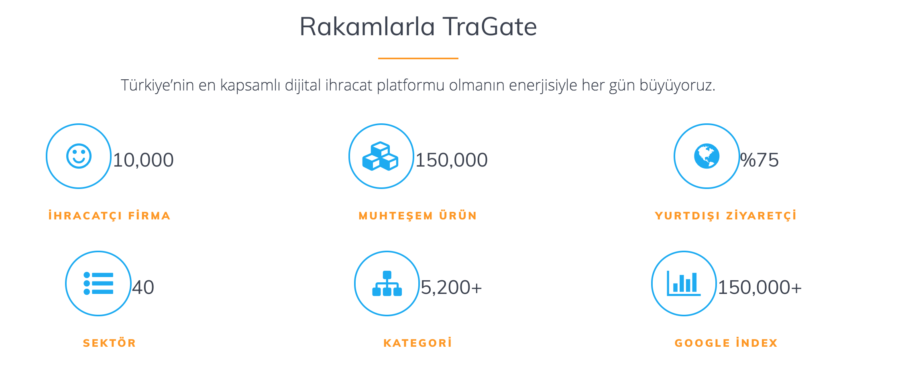

## The Screenshots of System Infrastructure 
 

## Technologies implemented:

- ASP.NET Core 2.0 (with .NET Core)
 - ASP.NET WebApi Core
- Entity Framework Core 2.0
- .NET Core Native DI
- AutoMapper
- FluentValidator
- MediatR
- Swagger UI
- MSTest & Moq
- Docker & Docker Compose

## Architecture:

- Full architecture with responsibility separation concerns, SOLID and Clean Code
- Domain Driven Design (Layers and Domain Model Pattern)
- Domain Events
- Domain Notification
- CQRS (Imediate Consistency)
- Event Sourcing (Eventually Consistency)
- Unit of Work
- Repository and Generic Repository

## About:
The Tragage Api was developed by tragate-tech

## Tragate Numbers

## Disclaimer

Özetle command handler'lar üzerinden gelişen sistemler
microservice'lere bolunecek kadar domain bilgisi içerilmediğinde tasarlanırlar.

Aslında her command bir baska command'a veya event'e sebep olabilirler.
Ve domain veya integration event raise ederek diger external sistemlerle 
veya bounded context'lerle haberleşerek bir business usecase'i gerçekleştirirler.

Ama gerçek dünyada işler bu şekilde başlamaz. Domain'i bilemezsiniz.
Nasıl bir mimari kuracagınızı bilemezsiniz. Domain ogrendikten sonra mimariler o domain problemlerine hizmet etmek amacıyla tasarlanırlar.

Generic bir mimari olmadıgına gore monolith baslamak en saglıklısıdır.

Bu sebeple genel enterprise app'lerde ki patternlere baktıgınızda sürecler 2 kategoriye ayrılmıs bir şekilde calısma eğilimi gosteriri.

1. command
2. query

Command'lar baska commandları call edebilirler ki buna long running process diyoruz. Aynı zamanda eventleri call edebilirler ki buna transactional boundary diyoruz .

Command call ederken integration , bounded context call ederken ise domain eventler soz konusudur.

Bu sistemin ayrılmıs hallerine microservice patterns deniyorken modullere ayrılmıs hallerine ise modular arch. patterns denir.  Peki ya domain bilgisi henuz net değilse ? Neyi nerden ayıracagınıza hakim değilseniz ?
Seems'ler yani kesişim ve ayrım noktaları kafanızda canlanmıyorsa ?

İşte bu durumda bu patternlerin monolith bir düzlemde calısması gerekir. Yani maddenin yapı tasını olusturacak quatunumu düzgün design ederseniz bu madde büyüdüğü zamanda aslına sadık kalacaktır ve dogru bolunecektir.Business büyüdüğünde kod küçülecektir ve microservice'ler adını alacaktır.

İşin en zor kısmı bu tohumu atabilmektedir. 
- O yuzden cqs ile baslayan bir servisler void ve return type'a ait methodlar ile tasarlanmaya baslanır.
- sonra bunlar ayrı servisler olur
- sonra commandHandler'lar olurlar ve usecase süreci burada gerçekleşir.
- Eger net değilse bir use case içinde tüm handler'ları barındırmaz her process bir main handler'a referans vererek parçalara ayrılabilir.
- aynı domain grubuna sahip handler birbirleri ile haberleşebilir. O yuzden INotification handler'ların temel interface'i olmustur bu projede. Bu interface simetrisi 2 method'a sahiptir. Send ve raise . 
- eger bir command aynı business bir baska transaction'a sahip ise bunu call eder . Bu sürec içinde arada bu command'ların da eventleri olabilir. En son state'ten sonra main process'e ait son bir event'e olabilir. 
- Yani hepsi bir transaction'ın parcasıda olabilir. Transaction bittikten sonra raise edilecek baska bir transaction'ın konusu olan event'lerde olabilir.
- Bunlar paralelde ilerliyebilir paralel convoy pattern gibi sync'de.
- dist. bus ile de ilerliyebilir inmem'de.
- Sonuc olarak kus bakısı baktıgınıza command'lar arası sürekli command ve event alısverisi gorursunuz. Active to Reactive  denir tersi de mümkündür.
- Bir sistemin anlamaya calısırken bu iletişim sınırları domain sınırlarını olusturur. Yani olgun bir seviyeye gelindiğinde bu handler'ın command ve event path'i izlenerek bir context cıkartılır. İşte buna bounded context denir ve her command message'ları bir usecase'e sonucunda olan event'lerde domain event'lere transaction dısındaysa integration event'ler denk gelecek şekilde sistem evaluate olur. 
- O yuzden ilk etapta adı anemic domain model'dir. Sonra bu usecase'lerin için de tüm mikro command process'leri toplar bir transaction içinde yonetir. Bu transaction 'lar internal sistem de ise bir domain'i create ederler ve aggregate'ler arası transaction saglarlar. Eger multiple aggregate'ler varsa domain event'ler ile haberleşirler. Yoksa event baska bir bc'ye gitmek üzere infra üzerinden integration ile halini alır e bus gonderilir. Eger external ise command handler yani usecase'ler üzerinden bir adapter ile call yapılır ve publish edilir. 
- Gün sonunda zero to hero olana kadar tüm iletişim sistemi application katmanından yürür. Bu katman ekseriyetle iletişim , behaivoral , decorator gibi design patternleri kullanmaya meyillidir.
- Domain aggregate'ler ile şekillenmeye baslayınca artık bir microservice'iniz vardır. Monolith ile baslayan sürec modular monolith ve microservice olarak devam eder. 
- Sonra ise reactive microservice olabilir. Dikkat ederseniz ilk basta da reactive monolith olarak tasarlanmıslardı. Yani microservislere uzanın kısım aslında transaction'ları yonetebilmek için dogru adımların fazlandırılmasından ibaretti.
- Bu sistem dogru bir şekile ayrıldıgı takdir gerekli goruldugu durumda event sourcing kullanılabilir. O da business'ın farklı bir uygulamasıdır ki yük alıntında load'u bolebilmek bir kazanıma ulasabilmek için bir dizi patterni ve prensibi uyguladıgınız event store makenizmasıdır. 
- Özetle tüm ürün ilerde scale edebilecek dogru zemine oturtulmak için çalışılır. Herşey yine maliyetleri azaltmak ve kolay ölçeklenmek için bir path olusturmak içindir . Medeniyetimiz buralara adım adım geldi ve hiç kolay olmadı.
- Bu sistemlerin hepsinin altında yatan disiplin ise cloud native olma cabasıdır.  [netcorekit](https://github.com/bilalislam/netcorekit) projesi ile bu sistemin genel catısı olusturulmus ve usecase'ler daha clean , domain'i insa eden , transactional olan ve bunu usecase'lerin sorumluluguna veren bir sistem design edilmiştir. Infra katmanında ise eventler'in tekrar domain eventler ile diger aggragate'i modular kapsamında ya da publish ederek bir baska bc'yi outbound olarak kullanacak şekilde calısması saglanmısıır. Yani application > domain > infra ilişkisi tam anlamıyla saglanmıs reactive ve anemic domain modeline sahip bir monolith mimari yerine clean architecture ve ddd prensiplerine bırakarak aynı işlemler refactor edilmiştir.